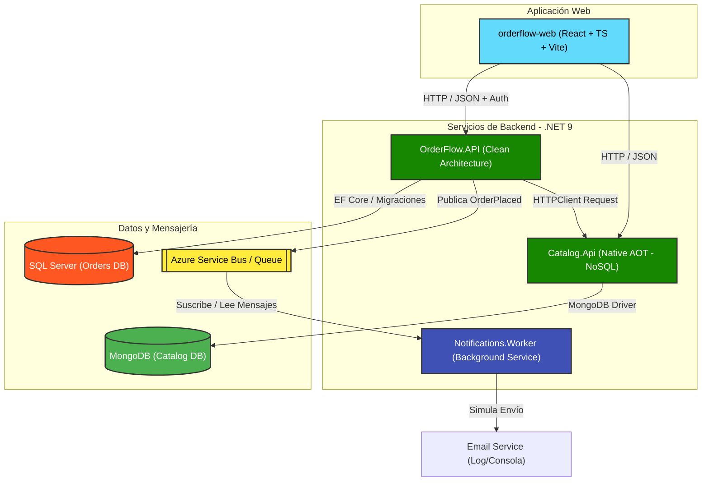

# OrderFlow 🚀 - Sistema de Gestión de Pedidos en Microservicios

**OrderFlow** es un proyecto de portafolio de nivel empresarial que demuestra una arquitectura de microservicios robusta y moderna. Está diseñado utilizando tecnologías de vanguardia en el ecosistema de **.NET 9**, **React**, **Docker** y **Terraform** en la nube de **Azure**.

El sistema permite gestionar un catálogo de productos, autenticar usuarios, procesar pedidos y enviar notificaciones en segundo plano de manera asíncrona.

---

## 📐 Arquitectura del Sistema

El siguiente diagrama detalla la arquitectura de la solución, sus interacciones y cómo se integran las bases de datos y la mensajería asíncrona:



---

## ✨ Características Clave

* **Arquitectura Limpia (Clean Architecture):** El microservicio de pedidos (`OrderFlow.API`) está organizado bajo los principios de separación de responsabilidades y modularidad en capas: *Domain*, *Application*, *Infrastructure* y *API*.
* **Native AOT (Ahead-Of-Time) en .NET 9:** El microservicio de catálogo (`Catalog.Api`) está preparado para compilación Native AOT, reduciendo drásticamente el consumo de memoria y el tiempo de arranque (Cold Start), ideal para entornos Serverless o Container Apps.
* **Carter para Enrutamiento Modular:** Ambos microservicios usan [Carter](https://github.com/CarterCommunity/Carter) para mapear endpoints de Minimal APIs de manera modular, evitando controladores sobrecargados y mejorando la legibilidad.
* **Mensajería Asíncrona (Event-Driven):** Cuando se crea un pedido, `OrderFlow.API` publica un evento en **Azure Service Bus**. El servicio de fondo `Notifications.Worker` procesa este mensaje de forma asíncrona para simular notificaciones por correo.
* **Infraestructura como Código (IaC):** Configuración de Terraform en la carpeta `infra` para aprovisionar todos los recursos necesarios en **Azure** (Container Apps, Cosmos DB MongoDB API, Azure SQL Database, Service Bus, etc.).
* **Contenedores con Docker:** Todo el entorno local se levanta con un solo comando gracias a Docker Compose, incluyendo bases de datos e imágenes personalizadas de los servicios.
* **Frontend Moderno:** Una interfaz de usuario limpia construida con React, TypeScript y Vite, que incluye soporte para autenticación JWT, un carrito interactivo de compras, catálogo de productos y visualización del historial de pedidos con generación de facturas (Invoice modal).

---

## 📂 Estructura del Proyecto

A continuación se detalla la estructura principal del monorepo:

| Directorio / Archivo | Descripción |
| :--- | :--- |
| 📁 [orderflow-web](file:///d:/Portfolio/orderflow-web) | Frontend SPA en React, TypeScript y Vite. |
| 📁 [OrderFlow.API](file:///d:/Portfolio/OrderFlow.API) | Microservicio de Pedidos (Punto de entrada, Autenticación JWT y Endpoints con Carter). |
| 📁 [OrderFlow.Application](file:///d:/Portfolio/OrderFlow.Application) | Lógica de negocio de pedidos organizada por Features. |
| 📁 [OrderFlow.Domain](file:///d:/Portfolio/OrderFlow.Domain) | Modelos de dominio y contratos de repositorios de pedidos (Libre de dependencias externas). |
| 📁 [OrderFlow.Infrastructure](file:///d:/Portfolio/OrderFlow.Infrastructure) | Acceso a datos (Entity Framework Core, SQL Server), seguridad y llamadas HTTP externas. |
| 📁 [Catalog.Api](file:///d:/Portfolio/Catalog.Api) | Microservicio de catálogo con MongoDB (API NoSQL compatible con Native AOT). |
| 📁 [Notifications.Worker](file:///d:/Portfolio/Notifications.Worker) | Worker en segundo plano que procesa los eventos desde Azure Service Bus. |
| 📁 [infra](file:///d:/Portfolio/infra) | Archivos de configuración de Terraform para el despliegue en Microsoft Azure. |
| 📄 [docker-compose.yml](file:///d:/Portfolio/docker-compose.yml) | Orquestación de contenedores para ejecución y pruebas en el entorno local. |
| 📄 [OrderFlow.slnx](file:///d:/Portfolio/OrderFlow.slnx) | Archivo de solución moderno de Visual Studio para agrupar los proyectos .NET. |

---

## 🚀 Guía de Inicio Rápido (Local)

### Requisitos Previos

* [Docker Desktop](https://www.docker.com/products/docker-desktop/) instalado y en ejecución.
* [.NET 9 SDK](https://dotnet.microsoft.com/download/dotnet/9.0) (opcional, para desarrollo local sin contenedores).
* [Node.js v18+](https://nodejs.org/) (opcional, para ejecutar el frontend fuera de Docker).

### Ejecución en 1 Paso

Para levantar todo el ecosistema (APIs, Frontend, SQL Server y MongoDB) en contenedores Docker, abre una terminal en la raíz del proyecto y ejecuta:

```bash
docker-compose up -d --build
```

Esto descargará las imágenes base, compilará los microservicios de .NET y el frontend de React, e iniciará todos los contenedores en segundo plano.

### Puertos y Enlaces de Servicios Locales

Una vez levantado el entorno con Docker Compose, puedes acceder a los siguientes servicios:

| Servicio | URL / Puerto | Descripción |
| :--- | :--- | :--- |
| **Frontend Web** | `http://localhost:5173` | Panel de control interactivo (React + Vite) |
| **Orders API** | `http://localhost:5000/swagger` | Documentación Swagger del Microservicio de Pedidos |
| **Catalog API** | `http://localhost:5299/swagger` | Documentación Swagger del Catálogo de Productos |
| **SQL Server** | `localhost:1433` | Base de datos relacional para pedidos (Usuario: `sa`, Contraseña en docker-compose) |
| **MongoDB** | `localhost:27017` | Base de datos NoSQL para el Catálogo de Productos |

---

## ☁️ Infraestructura en la Nube (Azure + Terraform)

El directorio `infra` contiene la configuración de Terraform para desplegar toda la arquitectura de forma automatizada en Microsoft Azure.

### Recursos Desplegados

1. **Azure Resource Group** para organizar todos los componentes.
2. **Azure Container App Environment** + **Container Apps** para alojar el frontend, APIs y el worker.
3. **Azure SQL Server y Azure SQL Database** para almacenar los datos relacionales de pedidos.
4. **Cosmos DB con API de MongoDB** para almacenar los productos del catálogo.
5. **Azure Service Bus Namespace & Queue** para la comunicación orientada a mensajes.
6. **Azure Key Vault** para la gestión y almacenamiento seguro de secretos.
7. **Azure Container Registry (ACR)** para alojar las imágenes Docker compiladas.
8. **Log Analytics y Application Insights** para monitoreo, telemetría y observabilidad distribuida.

### Pasos para desplegar

1. Asegúrate de tener instalado el [CLI de Azure](https://learn.microsoft.com/cli/azure/) y haber iniciado sesión (`az login`).
2. Entra en el directorio de infraestructura:

   ```bash
   cd infra
   ```

3. Inicializa Terraform:

   ```bash
   terraform init
   ```

4. Crea un archivo llamado `terraform.tfvars` dentro del directorio `infra` para guardar tus variables y contraseñas de forma segura (este archivo está excluido en el `.gitignore` para evitar filtraciones de credenciales):

   ```hcl
   db_admin_password = "<YOUR_SQL_PASSWORD>"
   ```

5. Genera un plan de ejecución y aplica los cambios:

   ```bash
   terraform apply
   ```

---

## 🔒 Autenticación y Pruebas en la API

La aplicación viene configurada por defecto en modo de desarrollo con **autenticación basada en JWT**.

1. **Crear usuario / Login:** A través del frontend o de Swagger (`/swagger` en `http://localhost:5000`), puedes registrarte e iniciar sesión para obtener un token JWT.
2. **Autorización:** Los endpoints del microservicio de pedidos (`Orders.Api`) requieren la cabecera `Authorization: Bearer <TOKEN>` para las acciones de creación y lectura de pedidos. El catálogo (`Catalog.Api`) permite accesos de lectura públicos.
3. **Azure Active Directory:** Para entornos de producción, el backend cuenta con soporte integrado para **Microsoft Entra ID (Azure AD)** con sólo configurar las claves correspondientes en el archivo de configuración.

---

## 📝 Licencia

Este proyecto es libre para fines de portafolio, aprendizaje y demostración técnica. Desarrollado para mostrar capacidades de arquitectura cloud y desarrollo full stack.
